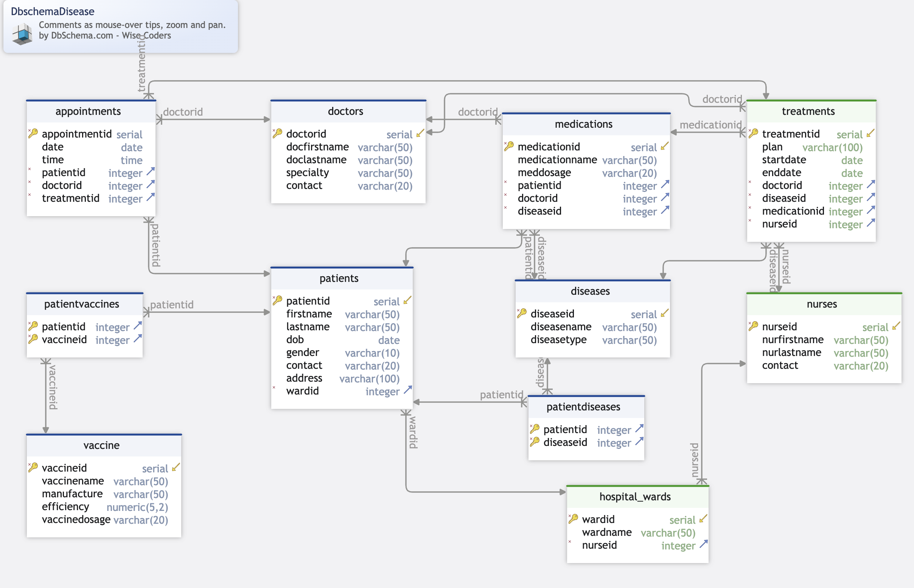
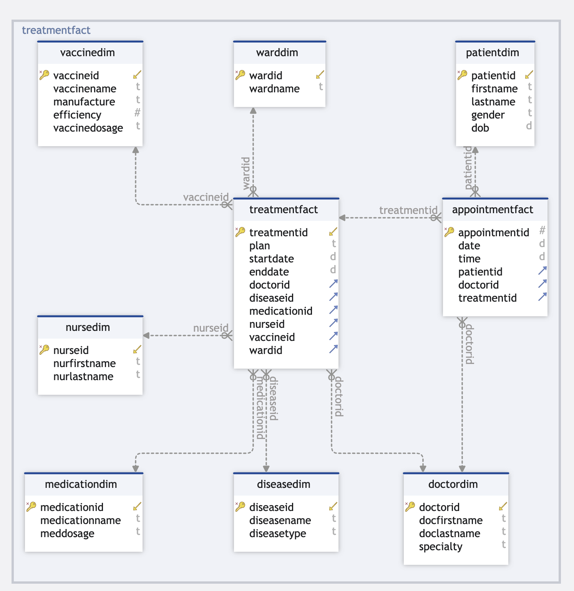

# Hospital Disease Track Warehouse ETL

A PostgreSQL-based Disease Management System with both OLTP and analytical (Data Warehouse) models to support hospital-level decision-making.

---

## 🏥 ER Diagram – OLTP Schema

The system tracks key hospital operations: appointments, doctors, patients, treatments, medications, and vaccinations.



---

## 📊 Dimensional Model – Data Warehouse Schema

Designed using the star schema model for optimized analytics and reporting.



---

## 📂 Project Structure

```plaintext
Hospital-Disease-Track-Warehouse_ETL/
├── ERD/
│   ├── Database-Schema.png             
│   └── DatawareHouse-Design.png        
├── oltp_schema/
│   ├── Create-Tables_Database-Disease.sql               
│   ├── Insert_Data_Database-Disease.sql                 
│   └── Operation-Report-DML-Queries-Database.sql         
├── data_warehouse/
│   ├── Create-DatawareHouse.sql                   
│   ├── Analytical-Queries-DatawareHouse.sql   
│   ├── ETL_process.sql                   
├── Future_Scope/
│   ├── FutureScope-AWS.docx           
│   ├── FutureScope-No SQL.docx  
│   ├── FutureScope-Snowflakes.docx      
├── LICENSE
└── README.md                           
```

---

## 💡 Key Features

- Normalized OLTP schema for hospital operations
- Star schema data warehouse for analytical queries
- ETL process to load and transform data
- AWS architecture guide for deployment
- Comparison with NoSQL for modeling alternatives

---

## 🔧 Technologies Used

- PostgreSQL for OLTP and DW
- SQL for queries and ETL
- DbSchema / draw.io for data modeling
- AWS (Lambda, S3, Snowflake) for architecture design

---

## 📈 Sample Analytics

- Effectiveness of treatments by doctor and disease
- Ward occupancy by gender/age
- Doctor workload performance
- Vaccine effectiveness and coverage
- Medication dosage pattern analysis

---

## 🚀 Getting Started

### Clone the Repository
```bash
git clone https://github.com/nikkirastogi/Hospital-Disease-Track-Warehouse_ETL.git
```

### Set Up PostgreSQL
- Install PostgreSQL
- Create a new database

### Deploy OLTP Schema
- Navigate to `Database_OLTP_Schema/`
- Run `Create-Tables_Database-Disease.sql` and `Insert_Data_Database-Disease.sql`

### Design the Data Warehouse
- Navigate to `data_warehouse/`
- Run `Create-DatawareHouse.sql` for dimensional schema

### Run ETL
- Execute `ETL_process.sql` to load data into DW

### Generate Reports
- Run queries `Analytical-Queries-DatawareHouse.sql` on warehouse or visualize via BI tools

---

## 🏥 Business Problem Definition

Hospitals face challenges integrating patient, treatment, and vaccination records. This system centralizes and optimizes healthcare data using a normalized OLTP and a star-schema DW for powerful insights and decision-making.

---

## 🪜 Development Steps

- ER Modeling + Data Dictionary
- OLTP schema creation with constraints
- Star schema using Kimball methodology
- SQL-based ELT pipeline
- Analytics + BI-ready design

---

## 🎯 Objective

Build a robust healthcare database that:
- Records patient, staff, disease, vaccine, and treatment data
- Handles complex M:N relationships
- Powers both operations and insights with SQL and ETL

---

## ✅ Key Use Cases

### OLTP:
- Appointment scheduling
- Medication tracking
- Vaccine management
- Nurse-ward assignment
- Patient demographic updates

### OLAP:
- Disease trend analysis
- Doctor performance evaluation
- Ward-level stats
- Vaccine effectiveness

---

## 💡 Business Impact

- Better patient care coordination
- Efficient resource allocation
- Regulatory compliance
- Public health surveillance
- Foundation for predictive healthcare
